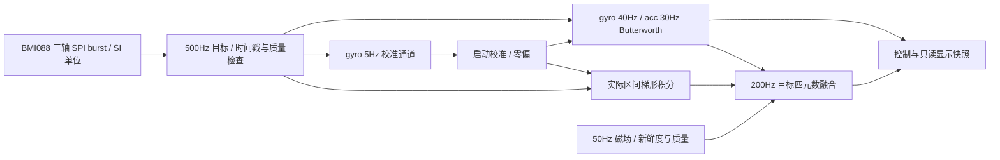

# 传感器采集、滤波与姿态解算

本次参考 PX4/Pixhawk 的传感器分层、滤波初始化、采样时间戳和轻量四元数姿态估计，
以及 ArduPilot 的独立 gyro/acc 滤波思路，按本工程 STM32F407、BMI088 和现有 SPI2 接线实现。
实现为独立 C 模块；未移植 PX4 的调度器、设备驱动或 EKF2 导航系统。

## 数据链路

## 采集与计时

- Sensor 任务绝对调度周期 2ms；每次读取加速度、角速度完整 XYZ，各一个 SPI 事务。
  ACC 为命令、dummy、六字节数据，共八字节；GYRO 为命令、六字节数据，共七字节。
  去除每轮重复读取量程和逐字节接收；温度每 100ms、气压每 50ms、磁场每 20ms 采集。
- BMI088 原驱动和自检保留。自检后由应用设置并读回配置：acc 800Hz normal bandwidth、
  gyro 1000Hz/116Hz bandwidth，量程固定为 ±3g / ±500°/s。读回不符则阻断姿态输入。
  三轴加速度转为 m/s²，角速度为 rad/s，磁场为 µT。
- `platform_micros` 使用 Cortex-M4 DWT 周期计数器，不占用 TIM/PWM/引脚。
  仅由 Sensor 任务调用，维护周期计数器回绕和余数；所有微秒差值按无符号回绕计算。
  时间戳取软件 SPI 采集区间中点，属于软件采集时间，不等同于芯片 DRDY/FIFO 硬件时间。
- 采样数据非有限、超出应用量程或间隔超出 0.5..10ms 时，丢弃积分区间并使姿态无效，
  后续滤波器由首个有效样本重新初始化。任务不连续执行补采来伪造丢失的数据。
- 姿态帧收集各采样区间的梯形角增量，以实际积分时长求平均角速度。
  不再用“最近一份读数 × 固定 5ms”代替整个区间；2ms 采集与 5ms 帧的 4/6ms 交替被保留。
  发布的毫秒时间戳取实际采集时刻，避免较晚处理把旧姿态伪装为新数据。

500Hz / 200Hz 是调度目标。实际频率与间隔必须通过 `IMU_PIPE` 日志和实物负载确认。
当前仍是周期轮询，未接入 DRDY、FIFO 或 SPI2 DMA；没有宣称达到 PX4 的高频原始采样率。

## 滤波与启动校准

| 通道 | 采集目标 | 低通截止 | 用途 |
|---|---:|---:|---|
| 陀螺仪控制 | 500Hz | 40Hz | 角速度控制与数值显示 |
| 加速度 | 500Hz | 30Hz | 重力方向修正与静止检查 |
| 陀螺仪校准 | 500Hz | 5Hz | 更平滑的绝对零偏样本 |

低通为三轴二阶 Butterworth，系数只在初始化或实测采样率变化超过 5% 时更新。
首个有效样本初始化内部延迟状态；不会从零加速度开始慢慢爬到重力值。
零偏在滤波后扣除，校准通道保留绝对角速度；更换零偏不会给滤波器制造突变。
这些截止频率是本板初始配置，不能当作所有机架的飞行调参结论。
当前没有电机 RPM/FFT 数据，未自动启用动态陷波。

校准开始后先等待滤波稳定 500ms，再按姿态帧收集连续 500 个有效样本，正常约 3 秒完成校准窗口。
包含约 1.5 秒的传感器初始化时，整次启动预期约 4.5 秒；实际取决于有效采样与运动状态。
每轴角速度绝对值 ≤0.15rad/s，校准通道标准差 ≤0.015rad/s；加速度模长与 9.80665m/s²
相差 ≤0.8m/s²，各轴加速度标准差 ≤0.15m/s²。门限位于板级配置，可按实测重新评估。

运动、重力不符、非法数值或窗口方差超限会重采；断采与滤波重配置也会重新稳定窗口。
开始时间始终保留，反复重采不会重置总超时。30 秒未完成则锁存失败、保持姿态无效，
屏幕显示“校准失败”，红灯常亮；静置后按 RESET 开始新尝试。失败不会强制通过解锁守卫。
每秒日志显示 `progress` 和 `rate/gravity/variance/invalid/timing` 重采计数。
低于运动门限的匀速慢转仍难与零偏区分，校准时应固定板子。

## 姿态融合

独立四元数互补融合模块使用区间平均 gyro 和实际 dt（最大 20ms），以旋转增量更新四元数，
并归一化。首次姿态根据实测重力方向和可用磁场初始化，不再固定单位四元数慢慢收敛。
原接口 roll 正方向、pitch/yaw 的旧符号约定在适配层保留；输出姿态仍为 rad，角速度仍为 rad/s。
本板加速度 +Z 约为 +g，不能直接套用 PX4 的特定机体坐标/比力符号。

加速度偏离 1g 时逐渐降低重力修正权重，偏差达到 20% 时只使用角速度传播。
在线零偏只使用重力可观测的倾斜修正，并投影去除绕重力轴的不可观测分量，限幅 ±0.05rad/s。
磁航向修正不再写入 gyro 的积分零偏；航向零偏依靠启动校准，磁修正只用受限比例项。
这样磁场受扰或退出时，残余磁修正不会被当成真实角速度持续叠加。高速转动冻结零偏学习。
非法 gyro/dt 或非有限四元数候选会拒绝更新，保留上一有效四元数。

磁场采集先检查 AK8975 ST1.DRDY，再整块读取 XYZ 和 ST2；错误/溢出不更新时间戳，
转换未完成时保留原数据年龄。ST2 读完后触发下一次单次测量，等待过程不阻塞惯性采集。
磁场要有有效 ID，采集年龄 ≤100ms，模长在 10..100µT 内；相对参考模长偏差 ≤25%，
航向创新 ≤45°，水平分量足够。世界坐标下的磁场创新用 2Hz 低通平滑，避免机体转动被滤波滞后。
正常磁航向比例增益为0.3，最大修正速率0.15rad/s；校准失效/未完成不参与解锁。
失败时继续惯性融合，恢复要累计十个不同时间戳的合格样本，再用一秒渐进恢复修正。
若无磁阶段已经积累超过45°航向误差，只在锁定、低转速和接近1g时允许渐进恢复；解锁中仍拒绝大创新。
界面的 9AXIS/6AXIS 取实际磁场参与状态；器件 ID 正常不等于当前磁场可用于航向。

磁校准改为三维椭球拟合：新鲜原始磁场采样，至少200点、八象限覆盖与残差检查，
生成硬铁偏置和完整对称3×3软铁矩阵。正常采样先应用 `M(raw-bias)`，再进入融合，矩阵不重复应用。
180秒超时、采集中取消和保存失败均保留原参数；只有片内Flash读回成功才启用候选矩阵。
校准结束后重新根据当前姿态初始化融合，流程见 [CALIBRATION.md](CALIBRATION.md)。
F407片内擦写会暂停Flash取指；仅锁定时保存，暂停采集并丢弃跨保存间隔，输出保持停止值。
六面加速度校准已接入：原始5Hz通道估计偏置/比例，正常数据先应用 `(raw-bias)*scale`，
再30Hz低通并送入启动重力检查与融合。任意顺序自动认面/采集，六方向对角椭球拟合允许粗略摆放；静置/方差/半窗口检查和300秒超时见CALIBRATION.md。
磁校准改为球面交互，采样/拟合参数保留，去掉强制每轴一圈的操作门槛；球面预览不代替椭球质量检验。
温漂模型、安装水平校准及加速度运动补偿仍属于后续工作。

## 日志与验证

- `IMU_PROFILE`：硬件配置读回、量程和 ODR。
- `GYRO_CAL`：滤波输入、门限、进度、重采原因、完成零偏或超时失败。
- `IMU_PIPE`：实际采样 Hz、dt 范围、读错误、非法数据、断采/滤波重置，重力权重与磁场参与。
- `HEADING`：航向创新（mdeg）、权重（千分比）、模长/水平分量（千分之一µT）、在线修正（mrad/s）、
  新磁样本/等待/错误次数、ST1/ST2，以及拒绝原因：0正常、1缺失、2过期、3范围、4模长变化、
  5近垂直磁场、6大航向创新、7恢复等待。
- `MAG_CAL`：采样/覆盖/拟合原因、RMS、场强、保存完成；启动打印已加载矩阵行和偏置。
- `ACC_CAL`：六面目标/识别方向、静置/采集阶段、样本数、方差拒绝原因、偏斜重采、保存及启动系数。
- `STORAGE`：片内后端、区代数、序号、保存票据、实际结果和读回确认；分区见 [FLASH_LAYOUT.md](FLASH_LAYOUT.md)。
- `SENSOR`：初始化返回值、校准中/失败、姿态有效性；每两秒/八秒启动健康摘要保留。

主机测试覆盖 SPI dummy/符号/SI 解码、滤波初始化与高频衰减、实测噪声水平模拟下的校准、
持续运动拒绝、超时锁存、零偏提交、时间戳重复/回绕/断采、可变 dt、磁场故障与渐进恢复、
加速度异常抑制、倾斜初始化和四元数拒绝回滚。测试不能替代真实采样、轴向和飞行控制验收。
航向回归覆盖实测0.016rad/s残余修正丢磁后的静止漂移、真实持续转动、解锁大创新拒绝、
锁定时的大误差渐进恢复，以及AK8975状态错误不覆盖上一有效磁样本。
本次椭球与片内日志存储完成Debug/Release编译，尚未新增或运行对应主机测试及实物验收。
原厂/旧数学库、SDK、SPI1显示接口和原链接脚本均保留；新增应用参数区链接断言。
旧链接诊断与严格CI限制见 BUILD.md。

## 官方参考

PX4 源码参考固定提交 `1af262c9257c120615019c0da436e725476b63a9`（2026-10-07 查询）：

- [PX4 二阶滤波与状态初始化](https://github.com/PX4/PX4-Autopilot/blob/1af262c9257c120615019c0da436e725476b63a9/src/lib/mathlib/math/filter/LowPassFilter2p.hpp)
- [PX4 轻量姿态估计：实际 dt、重力门限、磁航向、零偏限幅](https://github.com/PX4/PX4-Autopilot/blob/1af262c9257c120615019c0da436e725476b63a9/src/modules/attitude_estimator_q/attitude_estimator_q_main.cpp)
- [PX4 陀螺仪校准：稳健过滤、运动检查和有限重试](https://github.com/PX4/PX4-Autopilot/blob/1af262c9257c120615019c0da436e725476b63a9/src/modules/commander/gyro_calibration.cpp)
- [PX4 滤波与控制延迟](https://docs.px4.io/main/en/config_mc/filter_tuning)
- [ArduPilot gyro/acc 与陷波的分工](https://ardupilot.org/copter/docs/common-imu-notch-filtering.html)
- [Bosch BMI088 官方手册](https://www.bosch-sensortec.com/media/boschsensortec/downloads/datasheets/bst-bmi088-ds001.pdf)
- [Bosch 官方 BMI08x 配置定义](https://github.com/boschsensortec/BMI08x_SensorAPI/blob/master/bmi08_defs.h)
- [AKM AK8975/C 原厂手册（镜像）：ST1/XYZ/ST2与单次转换](https://strawberry-linux.com/pub/AK8975.pdf)
- [Linux AK8975驱动：数据就绪与结束状态检查](https://github.com/torvalds/linux/blob/master/drivers/iio/magnetometer/ak8975.c)
- [NXP AN4246：硬铁/软铁椭球模型](https://www.nxp.com/docs/en/application-note/AN4246.pdf)

上述资料用于设计和接口核对；工程新增模块为本项目 C 实现，并非直接复制整套 PX4/ArduPilot。
